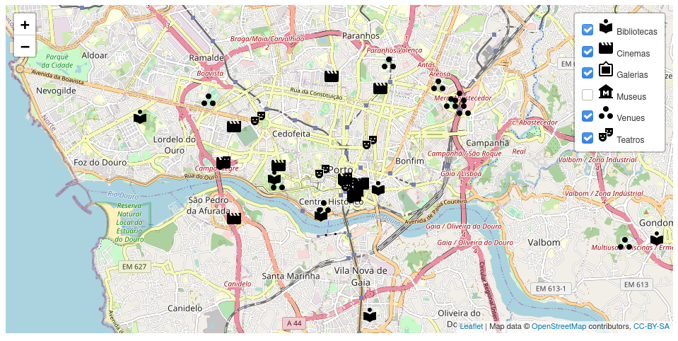
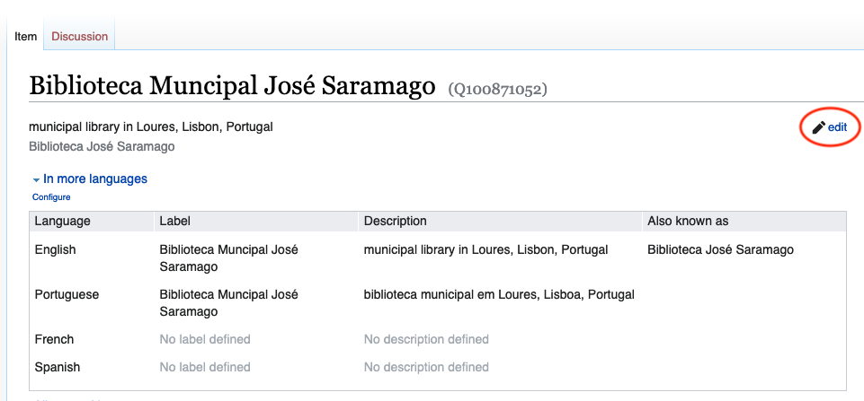

# Até onde chega a cultura?

## O projeto

Estamos a criar um mapa dos equipamentos culturais em Portugal.

[](https://interruptorpt.github.io/ate-onde-chega-cultura/mapa)

Este é um projeto comunitário do [Interruptor](https://interruptor.pt/) inspirado na série *[Até onde chega a cultura?](https://interruptor.pt/podcasts/interruptor)*, que explora a distribuição geográfica de diversos equipamentos no nosso território para tentar perceber o alcance da cultura. Foi iniciado durante o [Hacktoberfest 2020](https://interruptor.pt/artigos/interruptor-x-hacktoberfest).

Os contribuidores iniciais incluem membros de várias comunidades locais ligadas aos movimentos de cultura e software livres, nomeadamente: [Flutter](https://github.com/FlutterPortugal), [Python](https://python.pt/), [Ubuntu](https://ubuntu-pt.org/) e [Wikimedia](https://pt.wikimedia.org/wiki/Wikimedia_Portugal).

É possível ter acesso ao mapa por meio deste [link](https://interruptorpt.github.io/ate-onde-chega-cultura/mapa).

### O que queremos mapear?

- [x] [bibliotecas](https://interruptorpt.github.io/ate-onde-chega-cultura/mapa?categories=bibliotecas)
- [x] [teatros](https://interruptorpt.github.io/ate-onde-chega-cultura/mapa?categories=teatros)
- [x] [cinemas](https://interruptorpt.github.io/ate-onde-chega-cultura/mapa?categories=cinemas)
- [x] [museus](https://interruptorpt.github.io/ate-onde-chega-cultura/mapa?categories=museus)
- [x] [recintos de espectáculo](https://interruptorpt.github.io/ate-onde-chega-cultura/mapa?categories=recintos)
- [x] [galerias de arte](https://interruptorpt.github.io/ate-onde-chega-cultura/mapa?categories=galerias)
- [x] [monumentos](https://interruptorpt.github.io/ate-onde-chega-cultura/mapa?categories=monumentos)

## Contribuir

Qualquer pessoa pode contribuir para este repositório. Contribuições para o projeto pressupõem a aceitação da **[licença](LICENSE)** associada e do nosso **[Código de Conduta](code_of_conduct.md)**.

### Como contribuir?

1. Faz um *[fork](https://github.com/InterruptorPt/ate-onde-chega-cultura/fork)* do repositório.
2. Verifica se há algum *[issue](https://github.com/InterruptorPt/ate-onde-chega-cultura/issues)* aberto em que possas começar a ajudar.
3. Faz um *pull request*.

Se ainda estás a dar os primeiros passos no Github, eis alguma documentação útil:

- [Como fazer fork de um repositório](https://docs.github.com/en/free-pro-team@latest/github/getting-started-with-github/fork-a-repo)
- [Como fazer um pull request](https://docs.github.com/pt/free-pro-team@latest/github/collaborating-with-issues-and-pull-requests/creating-a-pull-request)

### Como adicionar novas localizações ao mapa?

A informação apresentada no mapa é recolhida a partir de entradas existentes no [Wikidata](https://www.wikidata.org).

#### Adicionar uma nova entrada

1. É provável que algumas localizações já existam no Wikidata, mas apenas não estejam associadas às categorias acima indicadas, pelo que convém procurar se as mesmas existem e [editar](#Editar-uma-entrada-existente)
   * *NOTA: Mesmo que seja criada uma entrada duplicada não haverá problema, pois as mesmas podem ser fundidas posteriormente*
2. No menu lateral, escolher "Criar um objecto novo" e acrecentar a informação nos campos obrigatórios *NOTA: A língua tem de ser pt ou en*
3. Depois de criar o objecto, temos de adicionar propriedades que correspondam aos filtros usados para popular o mapa. Escolher **adicionar declaração** e depois procurar as propriedades relevantes. Listamos as mandatórias:
   1. **país** - Portugal
   2. **coordenadas geográficas** - introduzir as coordenadas do local
   3. **instância de** - define a categoria do local. Escolher para as categorias do mapa:
      1. **Bibliotecas** - biblioteca OU biblioteca municipal
      2. **Cinemas** - sala de cinema
      3. **Galerias** - galeria de arte
      4. **Monumentos** - monumento
      5. **Museus** - museu
      6. **Recintos** - casa de shows
      7. **Teatros** - teatro
   4. Quando escolher o valor para cada propriedade, clicar em **publicar**
   5. Podem enriquecer os dados do local adicionado com outras categorias que achem relevantes


#### Editar uma entrada existente

1. Procurar a entrada que se quer editar disponível [nesta pasta](./tree/master/static-data)
2. Aceder ao Wikidata com o link correspondente e fazer as edições necessárias


#### Ver no mapa

Os dados do mapa são actualizados manualmente através do *script* que os extrai a partir do Wikidata, executando o seguinte comando num terminal com `python3` instalado:

```bash
$ ./scripts/update_static_data.py

saved output to ./ate-onde-chega-cultura/static-data/teatros.json
saved output to ./ate-onde-chega-cultura/static-data/cinemas.json
saved output to ./ate-onde-chega-cultura/static-data/monumentos.json
saved output to ./ate-onde-chega-cultura/static-data/recintos.json
saved output to ./ate-onde-chega-cultura/static-data/galerias.json
saved output to ./ate-onde-chega-cultura/static-data/museus.json
saved output to ./ate-onde-chega-cultura/static-data/bibliotecas.json
```
O resultado desta acção é a actualização dos dados que têm de ser posteriomente adicionados ao repositório através de um novo PR.

## Licença

O código desenvolvido e partilhado neste repositório é disponibilizado sob uma **[licença GNU-GPL3.0](LICENSE)**. Esta é uma licença de **software livre** que garante quatro liberdades fundamentais ao utilizador:

- Liberdade para utilizar o código para qualquer finalidade;
- Liberdade para estudar o código-fonte e para adaptá-lo conforme necessário;
- Liberdade para copiar e redistribuir o código;
- Liberdade para melhorar o código e redistribuir versões modificadas.

O código pode ser usado com fins comerciais. Contudo, novas versões devem garantir que o código-fonte continua público e acessível.
Podes consultar uma tradução não oficial da licença para português [aqui](http://licencas.softwarelivre.org/gpl-3.0.pt-br.html).
